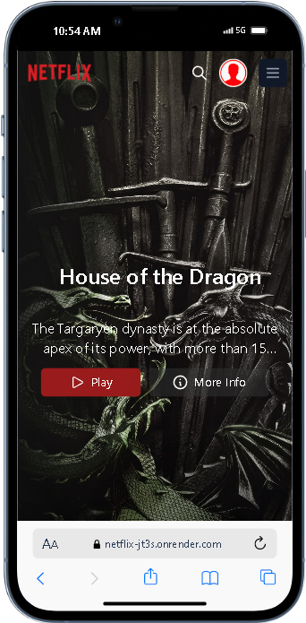

# Netflix Clone

Welcome to the Netflix Clone project! This project is a web application built with React.js and styled using Tailwind CSS. It mimics the UI and functionality of Netflix, allowing users to browse movies and TV shows, view details, and watch trailers.

## Demo

## 

## Features

- **Browse Movies and TV Shows:** Explore a collection of popular movies and TV shows.

- **View Details:** Click on a movie or TV show to see more information, such as synopsis, release date, and rating.

- **Watch Trailers:** Watch trailers of selected movies and TV shows directly on the website.

- **Responsive Design:** The application is designed to work seamlessly across various devices and screen sizes.

## ⚙️ Tech Stack

### Learning Opportunities

Working on this project offers numerous learning opportunities:

- **React.js**: Deepen your understanding of React components, state management, and hooks.
- **API Integration**: Learn how to fetch and display data from external APIs like TMDB.
- **Styling**: Explore responsive design techniques using Tailwind CSS or other styling libraries.
- **Contributions**: Gain experience in collaborative development, code reviews, and version control.

Certainly! Here's an enhanced and visually appealing version of your tech stack section, integrating contributions and learning opportunities:

### Contribute to Innovation 🚀

Join us in revolutionizing the entertainment experience with the Netflix Clone project! We welcome contributors of all skill levels to enhance our platform. Whether you're passionate about UI/UX design, backend integration, or frontend development, there's a place for you here.

**How to Contribute:**

1. **Fork** the repository and clone it locally.
2. **Create** a new branch for your feature or fix.
3. **Code** your magic and ensure it's robust.
4. **Submit** a pull request and let's collaborate!

### Elevate Your Skills 📚

Working on this project is more than just coding—it's an opportunity to expand your knowledge and master new technologies:

- **React.js**: Perfect your skills in building dynamic user interfaces with React.
- **API Integration**: Learn the intricacies of integrating external APIs like TMDB for fetching movie and TV show data.
- **UI/UX Design**: Polish your design skills with modern frameworks like Tailwind CSS and Swiper.
- **Collaborative Development**: Gain real-world experience in team collaboration, code reviews, and version control using Git.

Let's shape the future of entertainment browsing together while honing our craft. Ready to dive in?

---

**Project Images**

